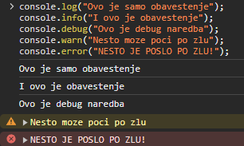

# Javascript

Javascript je jezik koji se primarno koristio za programiranje klijetskog dela
web aplikacija, ali se od skorijeg vremena koristi i na serveru uz pomoc node.js
runtime okruzenja.

## Sintaksa

Sintaksa javascript-a podseca dosta na programski jezik C, stim sto nije
tipiziran. U prevodu, kada deklarisemo promenjive ili parametre, ne mozemo da
navedemo kog ce tipa biti. Takodje, javascript je skriptni jezik koji se
interpretira. To znaci da se kod moze izvrsavati van funkcija i da je najsira
oblast vazenja promenjivih sam fajl u kom su definisane.

### Definisanje promenjivih

Promenjive se mogu definisati kljucnim recima `let` ili `var`, mada novije
konvencije predlazu `let`. Promenjive nisu tipizirane.

```js
// deklarisana promenjiva a
let a;
// deklarisana promenjiva b i inicijalizovana
let b = a + 1;
// deklarisana promenjiva c
let c = 3.14;
// dodeljena vrednost promenjivoj a
a = 5;
// dodeljena druga vrednost promenjivoj a drugog tipa
a = "Hello World";
// deklarisana konstanta koja ima vrednost promenjive a
const d = a;
```

### Ulaz i izlaz

S obzirom da je javascript nastao za potrebe programiranja browsera, on nema
podrazumevani nacin ulaza/izlaza. Stavise, u klijentskom okruzenju, ne postoji
nacin da se ucita nesto sa standardnog ulaza, jer on ne postoji. Sa druge
strane, postoji ekvivalent standardnom izlazu, a to je objekat `console`.
Koriscenjem metode `log` mozemo na browser konzolu ispisati sta god zelimo.
Postoji nekoliko metoda za ispis na konzolu i nivo ozbiljnosti:

| Metoda  | Nivo    |
| :------ | :------ |
| `log`   | Info    |
| `info`  | Info    |
| `debug` | Verbose |
| `warn`  | Warning |
| `error` | Error   |

```js
console.log("Ovo je samo obavestenje");
console.info("I ovo je obavestenje");
console.debug("Ovo je debug naredba");
console.warn("Nesto moze poci po zlu");
console.error("NESTO JE POSLO PO ZLU!");
```

Ako se ovaj kod pokrene dobijemo: 

[Dokumentacija o `console` objektu.](https://developer.mozilla.org/en-US/docs/Web/API/console)

Takodje, jedan od nacina izlaza koji je specifican za browser jeste alert.
Metoda `alert` stvara mini-prozor na vrhu pretrazivaca.

```js
alert("Zdravo, ovo je pozvano sa 'window' objekta").
```

 Kada se koristi u kontekstu klijentskog programiranja
(browser-a) onda javascript ima pristup skupu funkcionalnosti koje jednim imenom
zovemo **browser API**.

Ono sto nam browser API omogucava jesu sledece funkcionalnosti:

-   **Manipulacija DOM-om**: Manipulacija strukturom DOM stabla i sadrzajem
    elemenata unutar DOM stabla

-   **Dogadjaji**: Mehanizmi za upravljanje i odgovaranje na dogadjaje, poput
    kucanja na tastaturi, kliktanje misa, ucitavanje dokumenta itd.

-   **AJAX (Asynchronous Javascript And XML)** : mogucnost slanja i primanja
    struktuiranih podataka van standardnog request/response ciklusa

-   **Canvas i WebGL** : Mehanizme za crtanje 2D i 3D grafike unutar
    pretrazivaca

-   **Geolokacija** : Pristup geografskoj lokaciji korisnika

-   **Obavestenja** : Dozvoljava stranicama da prikazu obavestenja korisnicima

-   **WebSocket-i** : Omogucuje bidirekcionu komunikaciju u realnom vremenu
    izmedju browsera i servera koriscenjem jedne dugotrajne konekcije

## Manipulacija DOM-om

### Selekcija i pristup elementima

Nacin pristupa DOM stablu se vrsi preko `document` objekta. Elementima DOM-a
mozemo pristupati na osnovu:

-   tipa elementa `document.getElementsByTagName('div')`
-   klase `document.getElementsByClassName('card')`
-   id-a `document.getElementById('search-input')`
-   atributa name `document.getElementsByName('email')`
-   kombinovano
    -   `document.querySelector('button.btn-primary#accept')`
    -   `document.querySelectorAll('input[type='text']')`

Treba imati u vidu da ove metode vracaju referencu na jedan element ili listu
elemenata koji zadovoljavaju uslov selekcije.

### Menjanje sadrzaja elemenata
